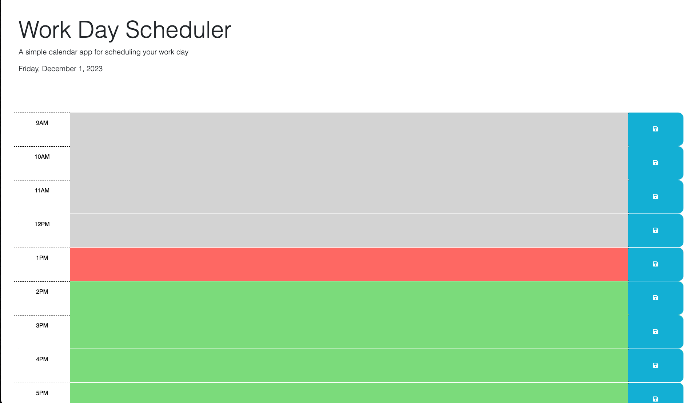

# Work-Day-Scheduler

## Description

My movtivation for this project was to create a Work Day Scheduler to help employees with a busy schedule add important events to a daily planner so that they can manage their time effectively.
This will help employees manage their time.

Throughout the development and implementation of the Work Day Scheduler, I learned key concepts in front-end web development and applied them using HTML, CSS, JavaScript, jQuery, and the Day.js library. I gained insights into DOM manipulation, event handling, and asynchronous loading of external scripts. The use of jQuery streamlined the code for interacting with the DOM, and Day.js facilitated time-related operations, allowing for dynamic updates based on the current hour. Additionally, I implemented features such as local storage to store and retrieve user input, enhancing the application's persistence. This hands-on project helped solidify my understanding of creating dynamic and interactive web pages while incorporating external libraries for enhanced functionality.

## Installation

N/A

## Usage

To use the Work Day Scheduler follow these steps:

Opening the Application:
Open the Work Day Scheduler in your web browser.

Current Day Display:
The current day is prominently displayed at the top of the calendar, providing you with real-time information.

Time Blocks:

Scroll down to view time blocks for standard business hours from 9 am to 5 pm.
Each time block represents an hour of your workday.
Color-Coded Blocks:

Time blocks are color-coded to indicate whether they are in the past, present, or future.
Past hours have a gray background, the present hour is highlighted in red, and future hours are green.
Entering Events:

Click on the time block for the desired hour.
Enter your event or task in the text area provided.
Saving Events:

Click the save button (floppy disk icon) next to the text area to save your event.
The event is stored in local storage, ensuring persistence even after refreshing the page.
Viewing Saved Events:

If you've saved events previously, they will be loaded automatically.
The text areas will display your saved events within the corresponding time blocks.
Persistence:

Your saved events persist even when you refresh the page, thanks to local storage.
By following these steps, you can easily utilize the Work Day Scheduler to manage and organize your daily tasks efficiently.

## Links

Link to Deployed App: (https://jlj98.github.io/Code-Quiz/)

## Credits

In the development of this application, I utilized external sources for enhancing JavaScript functions and implementing CSS styling, drawing insights from resources such as ASKBCS, Xpert Learning Assistant, ChatGPT, and YouTube to ensure a comprehensive and effective implementation.

## License

Please refer to the LICENSE in the repo.